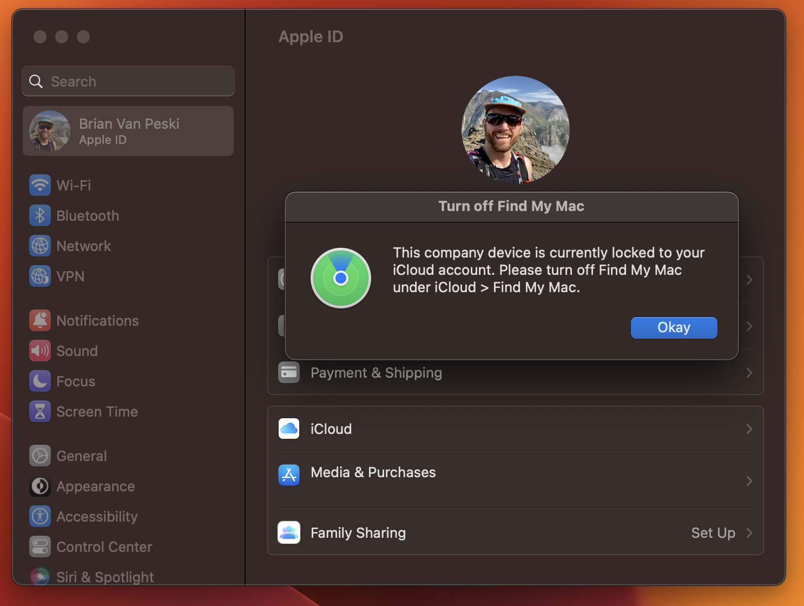

# UnActivationLock
A tool for helping prevent user-based Activation Lock issues.

This script checks to see if a machine has Activation Lock enabled, and if so, it will try to determine if the currently logged in user is the one associated with the activation lock, and prompt the user to turn off Find My Mac. If the device is enrolled in an MDM, this will give that MDM solution enough time to prevent future activation locks and gather an activation lock bypass code should the activation lock ever get turned back on.

This script is designed to assist with *existing* devices that were enrolled into an MDM when a user on the device is already logged into iCloud with Find My Mac enabled at the time of enrollment. To prevent activation lock on NEW enrollments, I **highly suggest** you enroll your devices using Automated Device Enrollment. That is the best way to avoid activation lock from happening in the first place. You can find more thoughts around user-based Activation Lock over on the [blog](https://www.macosadventures.com/2023/01/30/a-guide-to-disabling-preventing-icloud-activation-lock).

This script has been tested (somewhat) on macOS Montery 12.4 and macOS Ventura 13.1 on M1 and Intel Macs. This script has not been tested at scale or with multiple MDMs. iCloud can be a fickle thing sometimes, so this script is provided with no guarantees and the understanding that you use it at your own risk.

## Customizing the dialog
While this script was designed with Kandji in mind, it is designed to be plug-and-play for just about any MDM.

I’ve included two options for messaging the end-user leveraging the Kandji CLI or standard osascript, but feel free to add your messaging binary of choice if you prefer using <a href="https://github.com/bartreardon/swiftDialog" title="">SwiftDialog</a>, <a href="https://github.com/julienXX/terminal-notifier" title="">Terminal Notifier</a>, or other solutions.

I've included the ability to add an appIcon to the messaging. You can deploy and integrate your own custom icon, or use one that already exists on the machine. Here are a few suggestions:
`/System/Library/PrivateFrameworks/AOSUI.framework/Versions/A/Resources/AppleID.icns`
`/System/Library/PrivateFrameworks/AOSUI.framework/Versions/A/Resources/findmy.icns`
`/System/Library/PrivateFrameworks/AOSUI.framework/Versions/A/Resources/iCloud.icns`

I've set the iCloud icon as the default, since that helps the end-user visually understand the section of System Settings they need to be looking for, but feel free to customize this to suit your needs.

**Pro Tip:** osascript dialogs look pretty boring and dated these days in macOS, but adding a path to an app icon goes a long ways towards making it look less terrible.

## FAQ
* Does this work for both Manual and ADE enrollments?
  * Yes, either way if your MDM supports it, the default MDM behavior should be to DISALLOW user-based Activation lock. The important part to note here is that it *prevents* a device from becoming activation locked. It can't undo an Activation Lock that is already in place. That's why enrolling a device via ADE is the BEST way to ensure that the "disallow Activation Lock" key is in place, since with Automated Device Enrollment, the device itself is managed by the MDM BEFORE the user enters their iCloud account and/or turns on Find My Mac.
* What happens if someone turns Find My Mac back on after disabling it?
  * The device will continue to NOT be activation locked, assuming the MDM laid down the `Disallow Activation Lock` key.
* What if the device was activation locked by the MDM?
  * Device-based Activation Lock only applies to iOS and iPadOS devices.
* What if I have multiple users?
  * The script accounts for that and reports out which user caused the Activation Lock.
* Is there any way for a user to reactivate the activation lock after I've successfully disabled it?
  * If the device was manually enrolled AND the user has admin rights, activation lock would be reactivated once that MDM Profile is removed (either on the next reboot, or if the user toggles Find My off and on again).
  * Alternatively, if you have configured your MDM to `Allowed user-based Activation Lock', then activation lock will become active again once they turn Find My mac back on.
* Why does System Settings open to the AppleID section rather than the iCloud section on macOS Ventura?
  * As far as i'm aware Apple does not have a supported extension for that specific part of System Settings. If you know what it is, let me know! If that's a must have for your users then you can deploy a PPPC profile granting your MDM agent access to Accessibility and do some UI scripting with Applescript. I already have this lined up for version 2.
* Why didn't you just use `nvram fmm-mobileme-token-FMM` to determine Activation Lock status?
  * That reports on whether FindMy is enabled, regardless of actual Activation Lock status.
  
## What's Next?
* Not opening System Settings directly to the iCloud section of the Apple ID window in Ventura annoys me. I'll include some UI applescripting in v2 to handle that.

* I'll also grab the e-mail address of the offending iCloud account and put that in the logs for reference.

* Anything else you want to see in v.2? Weird Activation Lock edge cases? Let me know!
